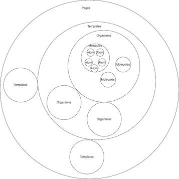

# Atomic Design

- [Atomic Design](https://atomicdesign.bradfrost.com/table-of-contents/)
   - [簡易版](https://bradfrost.com/blog/post/atomic-web-design/)

## Atomic Designとは？

Brad Frost氏により、提唱されたデザインパターン。
最小単位のパーツを作成し、それを組み合わせることでページを構築する手法。

(こんな↑図解よりも、こっち↓のほうが圧倒的にわかりやすかった)

引用：https://bradfrost.com/blog/post/atomic-web-design

### Atom...原子

label、input、buttonといったHTMLタグにて構成される 
その他にも、カラーパレット、フォントや見えないアニメーション等も含めることができる

`invisible aspects of an interface like animations`→`Good animation is invisible.`→良いアニメーションとは、違和感や不自然さがないこと

### Molecules...分子

Atom同士を組み合わせたものであり、最小限の基本的なパーツ

### Organisms...有機体

パーツ同士を組み合わせた意味のあるパーツ

### Templates...テンプレート

### Pages...ページ

